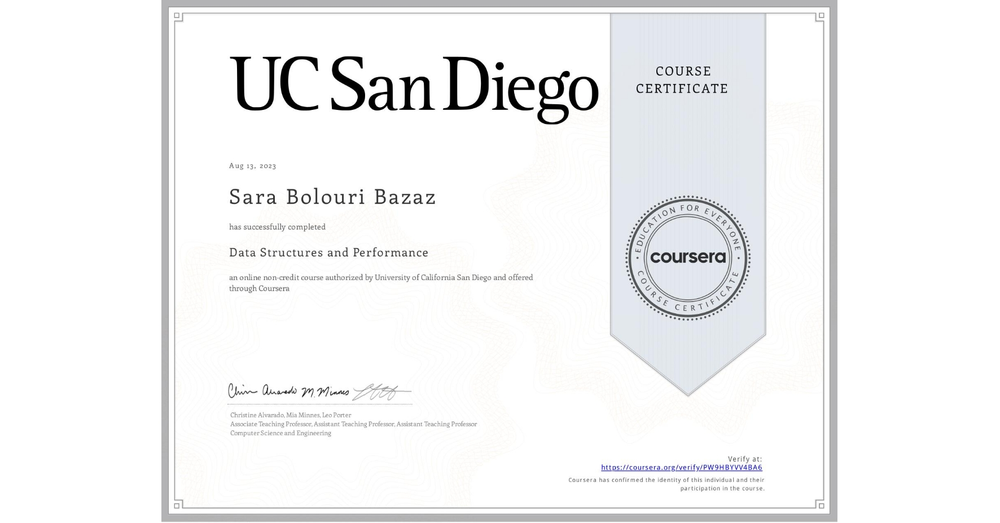

## Project Description

The project for this course is to build a smart text editor/processor that incorporates “intelligent” behaviors of modern-day text interfaces, including autocomplete, flagging misspelled words, and spelling autocorrect.  In each module, you’ll add more functionality to the editor through the project associated with that module.

	

## Certification

	

## Completeing Modules Week-by-Week
Below are the files introduced each week and used in each week of the course. See file for description...

- ### Week 1: Introduction and Working with Strings
	- document.Document.java
	- document.BasicDocument.java

- ### Week 2: Efficiency Analysis and Benchmarking
	- document.EfficientDocument.java

- ### Week 3: Interfaces, Linked Lists vs. Arrays, and Correctness
	- textgen.MyLinkedList*.java
	- textgen.MarkovTextGenerator.java
	- textgen.MarkovTextGenerator*.java

- ### Week 4: Trees! (including Binary Search Trees and Tries)
	- spelling.SpellingSuggest.java
	- spelling.AutoComplete.java
	- spelling.Dictionary.java
	- spelling.Dictionary*.java
	- spelling.AutoCompleteDictionaryTrie.java
	- spelling.TrieNode.java

- ### Week 5: Hash Maps and Edit Distance
	- spelling.WordPath.java
	- spelling.NearbyWords.java
	- spelling.WPTree.java

## How to Setup

### Create a new project:
1. Create a new Java Project in your workspace.
2. Import the starter files:
   File -> Import -> Select "File system"  
   Browse and set root directory to folder contents of the zip was extracted to -> Finish

### Import from existing file:
1. Copy the repository URL and by using `git clone`, clone the project to the desired directory.
2. Open the Eclipse IDE
3. Improt the project folder:
   File -> Import -> General -> Existing Project into Workspace  
   Select the project folder from the browser -> Check the "Copy projects into workspace" -> Finish
	
Feel free to use another IDE or manually compile and run your programs. If you need help, google is your friend.

